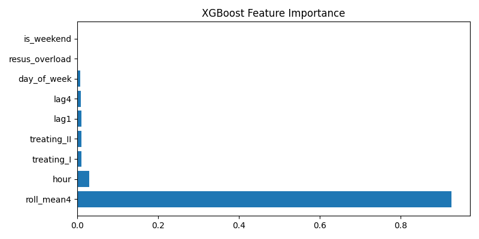

# A&E Crowding Prediction in Hong Kong Public Hospitals

Predicting emergency room congestion 30 minutes in advance using Machine Learning.

---

Project Overview

This project builds a binary classification model to predict whether an Accident & Emergency (A&E) department in a Hong Kong public hospital will become crowded in the next 30 minutes.

The goal is to help hospital managers proactively allocate staff and resources, reducing patient waiting times and frontline workload.

Key Achievement: Achieved AUC-ROC of 0.96 and identified over 90% of actual crowding events on the test set.

---

Problem Statement

Hong Kong public hospitals frequently experience A&E overcrowding, leading to:
- Long waiting times for semi-urgent and non-urgent patients.
- Heavy workload and fatigue for medical staff.

Our Research Question:
Can we predict A&E crowding 30 minutes ahead using only historical waiting-time snapshots and operational indicators?

---

Dataset

Source: Hong Kong Hospital Authority's open "Accident and Emergency Waiting Time" dataset (data.gov.hk).
Time Period: 1 January 2026 – 31 March 2026 (3 months).
Coverage: All 18 public hospitals with A&E departments in Hong Kong.
Frequency: Data published every 15 minutes.
Size: ~8,600 Excel files, combined into a single structured dataset.

Key Variables:
- timestamp (date & time)
- hospital (A&E department name)
- wait_I ~ wait_IV_V (estimated waiting times by triage category)
- treating_I, treating_II (indicators for critical case overload)

---

Methodology

1. Data Preprocessing
- Parsed waiting times from text (e.g., "1 hour" -> 60 minutes).
- Capped extreme values at 720 minutes (12 hours).
- Converted Y/N operational flags to binary indicators.

2. Feature Engineering
To capture temporal patterns, I constructed the following features:

Feature Name | Description | Business Logic
-------------|-------------|---------------
lag1 | Waiting time 15 minutes ago | Short-term trend
lag4 | Waiting time 1 hour ago | Medium-term momentum
roll_mean4 | Rolling average over past hour | Smoothed trend (most important)
hour, day_of_week, is_weekend | Time features | Captures daily/weekly patterns
treating_I/II, resus_overload | Operational status | Captures current capacity strain

3. Target Definition (Label)
- Crowded = 1 if median waiting time for semi-urgent/non-urgent patients > 120 minutes.
- Prediction Horizon: Predict crowded at t+2 (30 minutes ahead, since each row = 15 min interval).
- Data Leakage Prevention: Used shift(-2) to align labels with past features, ensuring the model does not see future information.

4. Class Imbalance Handling
- Crowded episodes are rare (~12-18% of data).
- Used class_weight='balanced' (Logistic Regression, Random Forest) and scale_pos_weight (XGBoost) to penalize misclassifying crowded instances.

5. Models Compared
- Logistic Regression: Baseline, interpretable, fast.
- Random Forest: Ensemble (Bagging), handles non-linearity well.
- XGBoost: Ensemble (Boosting), highest accuracy, best for tabular data.

---

Results

The models were evaluated on a temporal split:
- Training: Jan 1 – Feb 28, 2026
- Test: Mar 1 – Mar 31, 2026

Model | AUC-ROC | PR-AUC | Recall (Crowded) | F1-Score
------|---------|--------|------------------|----------
Logistic Regression | 0.9645 | 0.931 | 0.9085 | 0.8398
Random Forest | 0.9515 | 0.9044 | 0.8641 | 0.8265
XGBoost (Final) | 0.9685 | 0.9375 | 0.9218 | 0.8485

XGBoost was selected as the final model due to its highest recall (92% — meaning it catches 9 out of 10 real crowding events) and best overall discrimination ability.

Feature Importance (XGBoost)

The model identified roll_mean4 (average waiting time over the past hour) as the strongest predictor — which aligns with clinical intuition: if it's been busy for the last hour, it's likely to stay busy.

---

Power BI Dashboard (Bonus)

To make the model operationally useful, I exported the predictions and built an interactive Power BI dashboard. This allows hospital managers to:
- Monitor real-time crowding status across all hospitals.
- View 24-hour trend lines and 120-minute alert thresholds.
- Filter by hospital and weekday/weekend.

---

Tech Stack

- Programming: Python 3.9
- Data Processing: Pandas, NumPy, Regex
- Machine Learning: Scikit-learn (Logistic Regression, Random Forest), XGBoost
- Visualization: Matplotlib, Power BI
- Environment: VS Code

---

How to Run This Project Locally

1. Clone the repository:
git clone https://github.com/victoriayu0216/hospital_waiting_prediction.git
cd hospital-waiting-prediction

2. Set up virtual environment:
python3 -m venv venv
source venv/bin/activate  # On Windows: venv\Scripts\activate

3. Install dependencies:
pip install -r requirements.txt

4. Download the data from https://data.gov.hk/en-data/dataset/hospital-hadata-ae-waiting-time and place it in the data/ folder.

5. Run the main script:
python main.py

---

Future Work / Limitations

Limitations:
- Currently relies on aggregated waiting-time snapshots; lacks patient-level data (age, diagnosis) which could improve accuracy.
- Model trained on only 3 months of data; may not generalise to seasonal events.

Future Extensions:
- Integrate external factors (e.g., public holidays, flu surveillance data).
- Test longer prediction horizons (60 minutes).
- Develop hospital-specific models.

---

Author
Victoria